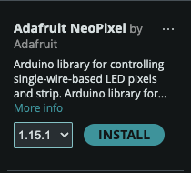

# Steps
1. Wire up the leds to the arduino  

  
  
2. Install the Adafruit Neopixel Library
    1. Click the library icon in the sidebar  
    
    2. Search for `Adafruit Neopixel`  
      
    3. Click `Install`
  
3. Flash the basic_blink example
    1. Download the sketch from this repo
    2. Open it with Arduino IDE
    3. Flash the sketch  
  
4. Try changing the speed of blinking
    - Hint: It's like changing the speed of the first blink demo  
  
5. Try changing the number of leds blinking
    - Hint: It's in the name of the definition  
  
6. Try changing the color of the leds
    - Hint: You'll need to learn about `RGB colors`  
  
7. Flash the marquee example
    1. Repeat the steps for the basic_blink example to flash the code
    2. What are the differences between the basic_blink example and the marquee example?
    3. Can you make each pixel a different color in the marquee?
